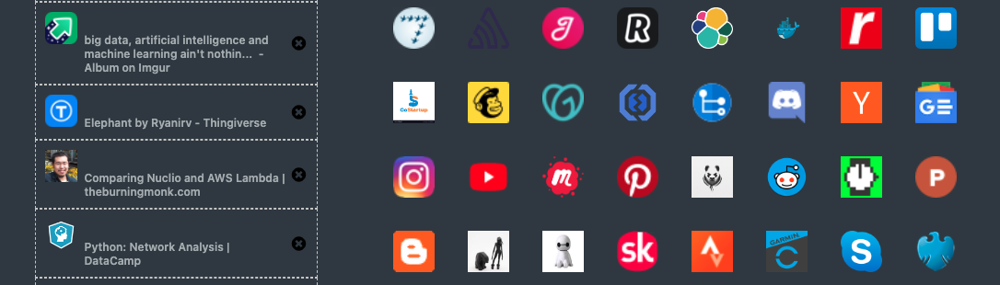
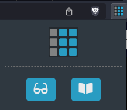
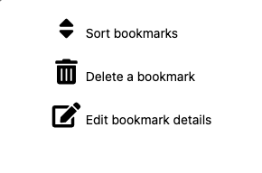
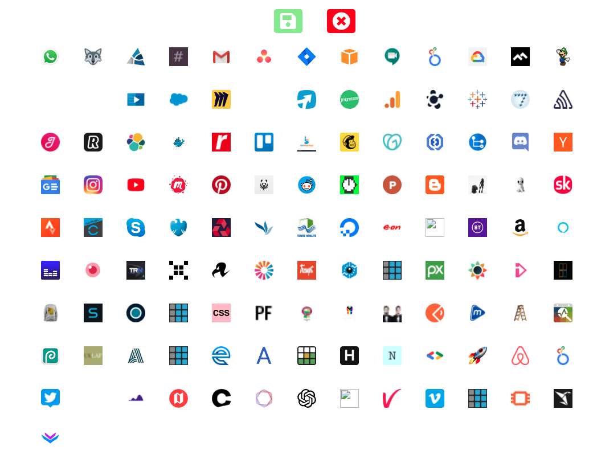

# comoketab - bookmarks and readinglist for chrome and brave

#### Have a new tab page with all your bookmarks and readinglist

#### Click to save to reading list or bookmarks on any page

#### Sort, edit, and delete your bookmarks

#### Sort example

# How to set up and run for yourself

## get python 3.11 for your operating system
`download latest 3.11 from https://www.python.org/downloads/macos/`

## MACOS run this to create new app environment
`/Library/Frameworks/Python.framework/Versions/3.11/bin/virtualenv -p /Library/Frameworks/Python.framework/Versions/3.11/bin/python3 py`

## activate environment
`source py/bin/activate`

## install requirements
`pip install -r requirements.txt`

## run app
`export FLASK_DEBUG=1`
`python server/tabserver.py`

## run redis in docker container
`docker run --name comoketab-redis -p 6379:6379 -d redis redis-server`